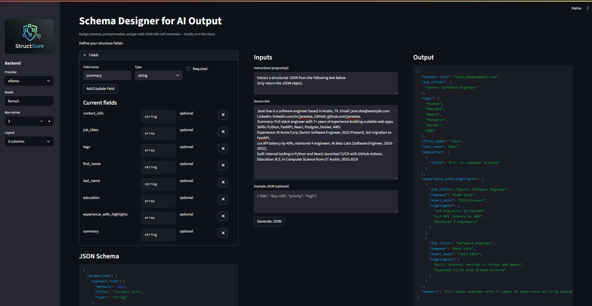

# structsure

<p align="center">
  
</p>

A simple, reliable library for getting structured JSON output from LLMs with self-correction.

- Monetization plan: see [docs/monetization.md](docs/monetization.md)

## Installation

- Ensure you have Python 3.8+
- Install locally in editable mode:

```
pip install -e .
```

Optional backends (recommended via extras):
- Local (Ollama): `pip install -e .[ollama]` and install a model like `ollama pull llama3`
- OpenAI: `pip install -e .[openai]`

## Examples

- Local tasks extraction (no API key): `python examples/local_tasks_demo.py`
- Local resume extraction (no API key): `python examples/resume_extraction_demo.py`
- Hybrid simple usage (auto-detect provider): see `examples/simple_usage.py`

## Schema Designer (GUI)

Design schemas, prompt models, and get valid JSON with self-correction — locally or in the cloud.

<p align="center">
  
</p>

- Install extras: `pip install -e .[streamlit,ollama]`
- Run: `streamlit run structsure/schema_designer_app.py`
- Features:
  - Define fields, see live JSON Schema
  - Split inputs: Instructions, Source text, Example JSON
  - Choose backend (Ollama/OpenAI), model, retries
  - 2- or 3-column layout with live output

## Choosing a local model (with Ollama)

Ollama is the local runtime; you still choose a model. Good defaults:
- Tiny/fast (CPU-friendly): `gemma2:2b`, `phi3:mini` (smallest footprint; fine for simple schemas)
- Mid-size (better accuracy): `mistral:7b`, `qwen2.5:7b`, `gemma2:7b`
- Balanced default: `llama3` (8B instruct)

Pull models (examples):
```
ollama pull llama3
ollama pull gemma2:2b
ollama pull phi3:mini
ollama pull mistral:7b
ollama pull qwen2.5:7b
```
Then run with `--provider ollama --model <name>` or set the model in the examples.

## CLI Usage

Install extras you need (example: local-only):

```
pip install -e .[ollama]
```

Basic usage (auto-detect provider: OpenAI if `OPENAI_API_KEY` set, else Ollama):

```
structsure "Extract a bullet list of tasks from: ..."
```

Specify provider/model and retries:

```
structsure "Extract JSON for ..." --provider ollama --model llama3 --retries 3
```

Use an input file and a JSON Schema file (generated from Pydantic):

```
structsure @prompt.txt --schema schema.json
```

## MCP Server

Install MCP extra (and a backend):

```
pip install -e .[mcp,ollama]
```

Start the server:

```
structsure-mcp
```

Exposed tool: `generate_structured`
- Params: `prompt` (str), `schema_json` (str, optional), `model` (optional), `provider` (optional; "openai" or "ollama"), `max_retries` (int)
- Auto-detects provider and defaults to `llama3` (Ollama) or `gpt-4o` (OpenAI) when not provided

## Quick Example

```python
import os
from pydantic import BaseModel, Field
from structsure import generate

provider = "openai" if os.environ.get("OPENAI_API_KEY") else "ollama"
client = None
if provider == "openai":
    from openai import OpenAI
    client = OpenAI(api_key=os.environ["OPENAI_API_KEY"])  # or OpenAI()

class UserProfile(BaseModel):
    name: str
    age: int
    is_active: bool
    email: str

prompt = "Create a profile for John Doe..."

user_profile = generate(
    client=client,
    model=("gpt-4o" if provider == "openai" else "llama3"),
    response_model=UserProfile,
    prompt=prompt,
    provider=provider,
)
print(user_profile.model_dump_json(indent=2))
```
